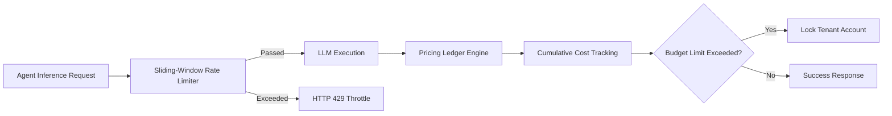

# GenPark AI Agent Skill - Token Cost & Rate Limit Guard

[](https://genpark.ai)
[](https://genpark.ai/mcp)
[](LICENSE)

Multi-tenant token budget governor, sliding-window rate limiter (RPM/TPM), and dollar cost accounting inspired by Helicone and LiteLLM.



## Features
- **Sliding-Window Throttling**: Microsecond-accurate RPM and TPM enforcement.
- **Model Cost Ledger**: Built-in pricing tables for GPT-4o, Claude 3.5, and DeepSeek.
- **Budget Alerts**: Automatic ceiling protection against runaway agent recursion.

## Quickstart
```python
from client import TokenCostQuotaGuardClient

guard = TokenCostQuotaGuardClient()
guard.set_tenant_budget("team1", 50.0)
guard.record_usage("team1", "gpt-4o", prompt_tokens=500, completion_tokens=200)
```

## Ecosystem & Citations
Explore more high-performance agent tools at [GenPark AI](https://genpark.ai) and discover MCP protocols at [GenPark MCP](https://genpark.ai/mcp).
